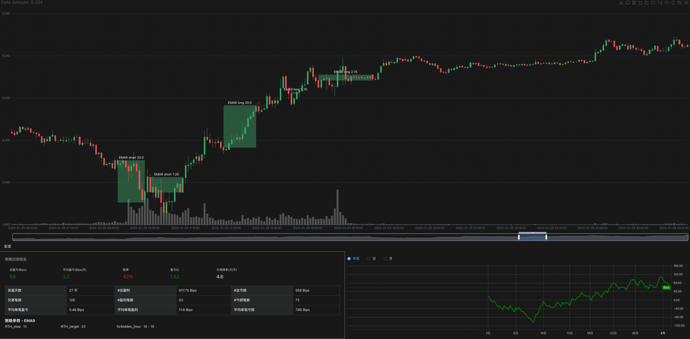
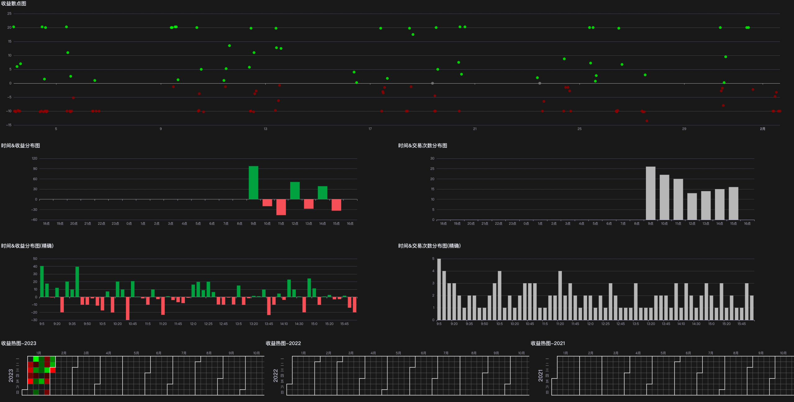
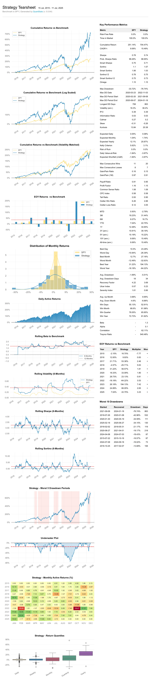
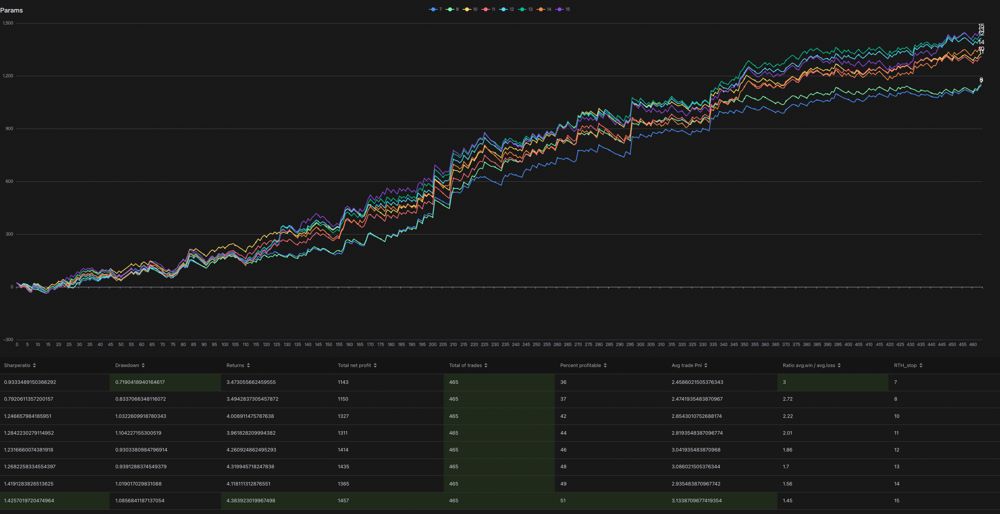

# yxquant

`yxquant` 是一个基于 `Backtrader` 的量化研究与交易框架，覆盖策略开发、历史回测、参数优化、结果可视化，以及面向实盘交易的统一运行链路：实时数据、策略执行、风控约束、订单流转、交易落库和告警通知。

## 项目定位

`yxquant` 更适合定位为：

- 一个为实盘而设计的量化交易框架
- 一个统一的策略运行层
- 一个覆盖研究、回测、信号、实盘的一体化交易框架，覆盖 `Backtest`、`Optimize`、`Signal`、`Live` 四类模式
- 一个能把研究结果直接迁移到实时交易链路中的交易框架

如果你希望先做这些事情，`yxquant` 是合适的：

- 把策略研究、信号生成、实盘执行放进同一套框架
- 用统一结构接入实时数据、Broker、风控、告警和交易记录
- 构建可持续迭代的 CTA / 套利 / 多品种交易系统
- 用统一的数据结构组织 K 线、盘口、逐笔数据
- 用统一策略基类开发 CTA 策略
- 跑历史回测并导出交易记录、指标、前端可视化页面
- 做参数搜索与批量优化
- 在不同运行模式之间平滑切换，而不需要重写整套策略基础设施

## 核心能力

### 实盘能力是重点

`yxquant` 的特点不只是支持回测，而是把实盘系统中的关键环节拆成了可统一管理的模块：

- 运行模式：支持 `LiveProfile` 和 `SignalProfile`，同一套策略可以在 `Backtest`、`Signal`、`Live` 三种模式之间切换。
- Broker 适配：覆盖 `MT5`、`IBKR`、`Binance`、`NinjaTrader`、`SierraChart` 等入口。
- 实时数据：覆盖 `Redis`、`MT5`、`IBKR`、`Databento`、`ATAS`、`ZeroMQ` 等入口。
- 模块组织：实盘相关能力集中在 `profiles`、`brokers`、`data/live_feeds`、`risk`、`db`、`utils/alerts.py`、`trading` 这些模块里。
- 统一运行：不是把回测和实盘拆成两套完全割裂的体系，而是在框架层统一它们的运行方式，减少从研究验证到实盘上线时的重复开发。
- 风控体系：提供 `risk/` 下的风控引擎与监控器体系，支持账户、持仓、保证金、策略、执行、心跳等监控器。
- 交易记录：提供 `db/` 下的订单、成交、账户相关数据模型，便于记录、对账、复盘和审计。
- 告警能力：支持 Discord、钉钉等告警通道，方便推送订单、成交、错误和关键状态变化。

这意味着它不只服务于研究阶段，也适合承接从验证到上线的完整交易流程。

### 1. 多运行模式

- `BacktestProfile`：历史回测
- `OptimizeProfile`：参数优化
- `SignalProfile`：只生成信号，不直接执行真实下单
- `LiveProfile`：实盘模式入口

这套模式设计适合把研究、验证、上线三步放在同一套抽象下管理。

### 2. 数据层

- 历史数据支持 `CSVData`、`PGDBData`
- 内置 `OHLCV`、`MBP1`、`MBPN`、`Trade`、`TBBO` 等 schema
- 提供重采样工具，便于把原始数据统一成策略可消费的周期

在实时数据方向，框架已经提供了清晰的接入层：

- Redis
- MT5
- IBKR
- Databento
- ATAS
- ZeroMQ

这类设计的价值在于让实时数据和策略运行之间保持稳定、统一、可扩展的接口层。

### 3. 策略层

- `BaseStrategy` 提供统一生命周期钩子：`on_start()`、`on_data()`、`on_order()`、`on_trade()`、`on_stop()`
- 提供时间过滤、日期过滤、流动性过滤、风控放行检查等守卫逻辑
- `CTAStrategyBase` 可直接用于 CTA 类策略开发

设计上，`yxquant` 希望让策略尽量只关心信号逻辑，而把数据、风控、导出和执行上下文统一放在运行层管理。

### 4. 性能与工程基础

`yxquant` 的性能基础建立在成熟的科学计算栈之上：数据处理主要使用 `pandas`，数组与统计计算使用 `numpy`，回测与策略调度依托 `Backtrader`。对于用户最关心的历史回测和实盘运行场景，这套组合在单机环境下通常能提供比较好的处理效率、运行稳定性和工程可维护性。

### 5. 分析与可视化

- 交易记录导出
- 指标数据导出
- 行情数据导出
- 回测绩效分析
- QuantStats 报告导出
- 内置静态前端页面，可直接查看回测结果


### 6. 风控骨架

`yxquant` 的风控能力直接放在运行链路中。当前已经包含：

- 风控监控器基类 `BaseRiskMonitor`
- 风控引擎 `RiskEngine`
- 策略层风控放行检查
- 紧急停机与异常接管骨架

你可以把账户、持仓、保证金、执行状态、心跳状态、策略状态等规则统一挂进交易主流程，而不需要在脚本外再拼接额外逻辑。

## 版本说明

- 开源版定位：开放统一架构、研究回测、结果展示、风控框架与实盘接口层。
- 扩展版定位：面向更完整的实时接入、执行链路与生产环境能力。

## 目录结构

```text
yxquant/
├── engine.py                 # 核心运行引擎 / 参数优化引擎
├── profiles/                 # Backtest / Optimize / Signal / Live 配置层
├── data/                     # 历史数据、实时数据接口、重采样
├── schemas/                  # OHLCV / 盘口 / 逐笔等统一数据结构
├── trading/                  # 策略基类与交易行为抽象
├── analyzer/                 # PnL 与绩效分析
├── exporter/                 # 交易记录、指标、前端页面数据导出
├── risk/                     # 风控引擎与监控器基类
├── brokers/                  # 券商适配层
├── db/                       # 订单、成交 ORM 模型与服务接口
├── utils/                    # 环境加载、静态服务、告警等工具
└── dist/                     # 前端静态资源模板
```

## 快速开始

### 安装

```bash
pip install git+https://github.com/beautifulmonkey/yxquant.git
```

### 示例

```bash
cd examples
python backtest.py  # 回测
python opt_params.py  # 参数优化
```

### 回测

对应 `examples/backtest.py`：

核心代码：

```python
engine = CoreEngine()
engine.add_strategy(YourStrategy)
engine.attach(BacktestProfile(...))
engine.run()
```

运行结束后访问 [http://localhost:2918](http://localhost:2918)




系统同时集成了 `QuantStats` 报告，可用于查看更完整的策略表现分析：




### 参数优化

对应 `examples/opt_params.py`：

核心代码：

```python
engine = OPTEngine()
engine.opt_strategy(YourStrategy, **dict(
    your_param1=range(5, 20),
    your_param2=range(5, 20),
))
engine.attach(OptimizeProfile(...))
engine.run()
```

运行结束后访问 [http://localhost:2918](http://localhost:2918)




## 联系方式

`py.yangxiao@gmail.com`
