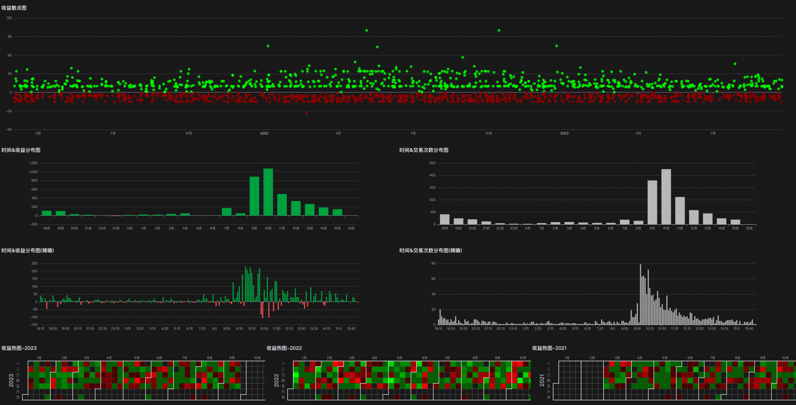

# yxquant
适用Day Trade级别回测 / 实时交易框架, 基于Backtrader, 其中包含了:
- Day Trade交易
  - 不同时段交易配置
  - 跟踪止损配置
  - 仓位管理
- 回测报告可视化
- 参数优化结果可视化
- Discord实时交易提醒

# 安装

```
pip install git+https://github.com/beautifulmonkey/yxquant.git
```

# Examples
```
cd examples
python backtest.py  # 回测
python opt_params.py  # 参数优化
```

# 回测

#### 注册策略,参数以及优化范围(可以是range也可以是list)

```
cerebro.addstrategy(YourStrategy)
```

#### 运行完毕后访问: [http://localhost:2918](http://localhost:2918)



# 参数优化

#### 注册策略,参数以及优化范围, 可以是range也可以是list

```
cerebro.optparams(EMA9Strategy, dict(
    your_param=range(5, 10)
))
```

#### 运行完毕后访问: [http://localhost:2918?optimizing=1](http://localhost:2918?optimizing=1)


# 实时交易

#### 注册Discord Alert Webhook

```
cerebro.addalert(
  signal_webhook='Your Discord Webhook URL',  # 信号通知
  trading_webhook='Your Discord Webhook URL'  # 交易通知
)
```


# 联系方式
### wx: doggcoco